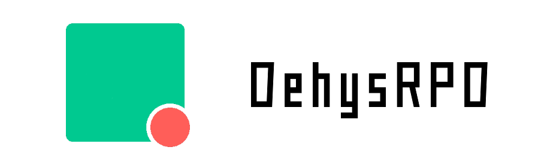
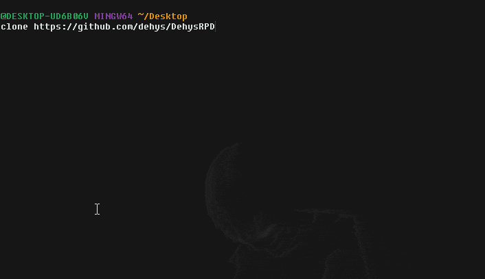

<div style="text-align:center"></div>

# DehysRPD - _Dehys Rich Presence for Discord_
This is a C# _implementation_ of the [Discord RPC](https://github.com/discordapp/discord-rpc).

A simple to use WinForms application using the _.NET Framework_ as well as a external dependency for rpc connection to discord. This dependency will be copied to the base directory on build.

This project was made out of fun and wasn't really taken serious but still has an installer, lol. All you 
have to do is create a [new discord-application](https://github.com/SinisterRectus/Discordia/wiki/Setting-up-a-Discord-application) on your discord account via the developer portal and link it to the program
with the Application ID provided by discord. Link it up, config your assets/display texts and **update**! Only problem with the
_Discord API_ is that you can't seem to override verified apps such as League of Legends or Fortnite **directly**. Only way around this
is if you go in-game and then **update** the _rich-presence_ withing the program. It might not show the custom _rich-presence_ to you
but it will update for users seeing your profile.

> We hope this is useful to you and we'd love to see new update idea's over at our [Discord](https://discord.gg/3JVTjhn).

#### Dependencies
 - .NET 4.6.1+
 
#### Building:
Firsty, clone the repository via git
```
git clone https://github.com/dehys/DehysRPD/
```

Open the DehysRPD.sln file in Visual Studio IDE and set the build type to **Release**.  
Build it and run the exe file (Make sure you have all the dependencies installed listed above).

**Here is a quick preview of what the process of building should look like:**


#### How to use:
- Start off by creating a new discord application over [here](https://discordapp.com/developers/applications ).  
- Set the default values such as name and change the application icon (not optional).  
- Now head over to the tab where it says **Rich Presence** and setup the rich presence part of the discord application.  
- Adding assets and setting the name of the rich presence client.  
- Now fill in the DehysRPD program with the given Application ID from the discord application as well as the asset names.  
- You are also able to choose a process preset by clicking the **▽** beside **Processes** and double clicking a running process in the list box.  
- This way you can setup your discord application with different assets for each process for quick changing.  

**Releases:** https://github.com/dehys/DehysRPD/releases
